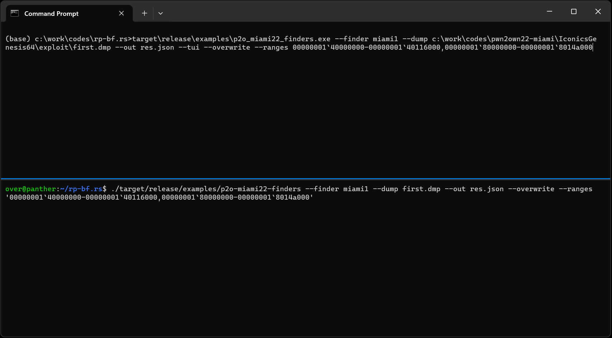

# rp-bf: A library to bruteforce ROP gadgets by emulating a Windows user-mode crash-dump


<p align='center'>

</p>

## Motivations

Oftentimes after hijacking control-flow, the author wants to pivot the stack into a region of memory that is under their control in order to start the execution of a ROP chain.

Finding the right candidate generally highly depends on much control you have over the CPU context when hijacking control-flow. It could be as easy as moving the value of a register into the stack pointer. But it could also be much more annoying like: dereferencing the `R8` register, adding the offset `0x10` to this value and then dereferencing again. You get the idea.

In 2022, I was writing an exploit for a use-after-free vulnerability that allowed me  to hijack control flow via a virtual call when exploited. The used-after-free object was a C++ object with a virtual table which meant that placing an object with arbitrary data gave me control over its virtual table and as a result over the control flow. Below is the sequence of assembly instructions that I was dealing with: `@rcx` pointed to a chunk of data I could control:
```text
00007ffb'0df751cb mov     rax,qword ptr [rcx]
00007ffb'0df751ce mov     rax,qword ptr [rax+10h]
00007ffb`0df751d2  call    qword ptr [00007ffb`0df82660] ; points to a `jmp @rax``
```
In order to be able to hijack control flow with an arbitrary value, I needed to find an address that followed the following equation: `[[rcx]+0x10]` 🤔.

This is rather annoying because it means you are looking for an address that points to a value, this value plus `0x10` also needs to point to a valid code address that'll get executed. On top of that, that code pointer needed to point to an assembly instruction that pivoted the stack somehow.

I first attempted to try to find a suitable candidate manually but I didn't find anything and gave up thinking I was asking too much off one gadget 🥺.

**rp-bf** is a library that I wrote to help solve that class of problems and allowed me to the right pieces to finish my exploit. If you are interested in reading about that whole saga, check out: [Competing in Pwn2Own ICS 2022 Miami: Exploiting a zero click remote memory corruption in ICONICS Genesis64](https://doar-e.github.io/blog/2023/05/05/competing-in-pwn2own-ics-2022-miami-exploiting-a-zero-click-remote-memory-corruption-in-iconics-genesis64/#hijacking-control-flow-roping-to-get-arbitrary-native-code-execution).

## How to build

The main dependency to manually set-up is the [bochscpu](https://github.com/yrp604/bochscpu) emulator. To set it up, run the following commands:

1. Go to [bochscpu-build/releases](https://github.com/yrp604/bochscpu-build/releases/tag/v0.3) and download the appropriate artifact archive for your platform (Linux, Windows or OSX)
1. Clone the [bochscpu](https://github.com/yrp604/bochscpu) repository with: `git clone https://github.com/yrp604/bochscpu.git`
1. Extract both the `lib` and `bochs` directories from the archive to the root of the cloned repository
1. Verify it builds fine with: `cargo build --release`

Then, you can simply:

1. Clone `rp-bf` with `git clone https://github.com/0vercl0k/rp-bf.rs.git` (same directory where you cloned [bochscpu](https://github.com/yrp604/bochscpu.git))
1. Build with: `cargo build --release`

## How does it work?

At a high-level, **rp-bf** emulates the code of your target from a process snapshot and allows you to define pre / post (did the stack pivot and do I still have control over the control flow? etc.) conditions that the library uses to find suitable candidates.

The library iterates over every memory region found in the snapshot and passes it to the user module. Then, the user can do whatever they want with this address.
```rust
pub trait Finder {
    fn pre(&mut self, emu: &mut Emu, candidate: u64) -> Result<()>;
    fn post(&mut self, emu: &Emu) -> Result<bool>;
}
```
In my case, I wrote this candidate address in the first 8 bytes pointed to `@rcx` to test and see if this candidate would allow me to hijack control flow and pivot the stack.

Ultimately, the user receives an instance of the emulator, a candidate address and is free to do what they want.

### Grabbing a snapshot

Although all the concepts are applicable to any OS or architectures, the current implementation focuses on Windows/Intel.

Generating a snapshot is very easy using the Windows debugger. Run your target under Windbg and generate a crash-dump (`.dump /ma`) at the desired location in the desired state. As an example, for my exploit I basically threw a payload that would make the process crash and then I fixed up its state in the `pre` function.

### Search algorithm

As mentioned above, **rp-bf** iterates through all the memory regions found in the crash-dump, recreate the same executing environment in the emulator.

Then, it invokes the user's pre condition, kick of execution until the emulator exits. At this point, the post condition is invoked to have the user decide if the candidate is suitable or not. The state of the emulator (memory and CPU context) is restored and rinse and repeat.

```rust
pub fn explore(opts: &Opts, finder: &mut dyn Finder, ui: &mut dyn ui::Ui) -> Result<Vec<Candidate>> {
    // ...
    for (mem_address, mem_block) in dump.mem_blocks() {
        // ...
        'outer: for candidate in mem_block.range.start..mem_block.range.end {
            // ...
            // Invoke the `pre` callback to set-up state.
            trace!("Trying out {candidate:#x}");
            finder.pre(&mut emu, candidate)?;

            // Run the emulation with the candidate.
            let (res, stats) = emu.run()?;
            how_many_total += 1;

            // We found a candidate if it lead to a crash & the `post` condition
            // returned `true`.
            let crashed = matches!(res, TestcaseResult::Crash);
            let found_candidate = crashed && finder.post(&emu)?;
            
            // ...
            emu.restore()?;
            // ...
        }
    }
}

```

### Emulating code from a user-mode Windows crash-dump

The emulator used is the [Bochs CPU emulator](https://github.com/bochs-emu/Bochs) via the [bochscpu](https://github.com/yrp604/bochscpu) library written by [@yrp604](https://github.com/yrp604).

The main challenge here is that the Bochs CPU emulates both user & kernel mode code. It deals with physical memory regions, architectural special registers, etc. But our user-mode crash-dump has no physical memory and only has the CPU registers that are visible from user-mode, basically the GPRs.

To recreate the execution environment in Bochs, **rp-bf** builds page tables to recreate the same virtual environment available in the user-mode dump.

Everything that is more specific to the OS and how they configured Intel special registers, this is stored in a profile. I've only worked on a [Windows 10 x64 profile](./win10_ux64.json). The profile is a simple JSON file that contains the values of special registers such as the segments, the control registers, etc. It should be pretty easy to add a Windows 10 32-bit mode, a Windows 10 kernel mode, or maybe even a more Linuxy environment.

### Writing a Finder module

A [Finder](https://github.com/0vercl0k/rp-bf.rs/blob/main/src/lib.rs#L295) module needs to provide a `pre` and a `post` method.
```c++
pub trait Finder {
    fn pre(&mut self, emu: &mut Emu, candidate: u64) -> anyhow::Result<()>;
    fn post(&mut self, emu: &Emu) -> anyhow::Result<bool>;
}
```
The `pre` method receives a mutable reference to the emulator as well as a candidate. In this method, you should 'inject' the `candidate` somewhere in the runtime environment. It might be setting a register to the `candidate` value, or to write it somewhere in memory; but ultimately this is specific to what you are trying to achieve. You can find two examples in [p2o-miami22-finders.rs](https://github.com/0vercl0k/rp-bf.rs/blob/main/examples/p2o-miami22-finders.rs#L310) (and you can read the full story for more background info at [Competing in Pwn2Own ICS 2022 Miami: Exploiting a zero click remote memory corruption in ICONICS Genesis64](https://doar-e.github.io/blog/2023/05/05/competing-in-pwn2own-ics-2022-miami-exploiting-a-zero-click-remote-memory-corruption-in-iconics-genesis64/#hijacking-control-flow-roping-to-get-arbitrary-native-code-execution)).
```rust
impl Finder for Pwn2OwnMiami2022_2 {
    fn pre(&mut self, emu: &mut Emu, candidate: u64) -> Result<()> {
        // Here, we continue where we left off after the gadget found in |miami1|,
        // where we went from constrained arbitrary call, to unconstrained arbitrary
        // call. At this point, we want to pivot the stack to our heap chunk.
        //
        // ```
        // (1de8.1f6c): Access violation - code c0000005 (first/second chance not available)
        // For analysis of this file, run !analyze -v
        // mfc140u!_guard_dispatch_icall_nop:
        // 00007ffd`57427190 ffe0            jmp     rax {deadbeef`baadc0de}
        //
        // 0:011> dqs @rcx
        // 00000000`1970bf00  00000001`400aed08 GenBroker64+0xaed08
        // 00000000`1970bf08  bbbbbbbb`bbbbbbbb
        // 00000000`1970bf10  deadbeef`baadc0de <-- this is where @rax comes from
        // 00000000`1970bf18  61616161`61616161
        // ```
        self.rcx_before = emu.rcx();

        // Fix-up @rax with the candidate address.
        emu.set_rax(candidate);

        // Fix-up the buffer, where the address of the candidate would be if we were
        // executing it after |miami1|.
        let size_of_u64 = std::mem::size_of::<u64>() as u64;
        let second_qword = size_of_u64 * 2;
        emu.virt_write(Gva::from(self.rcx_before + second_qword), &candidate)?;

        // Overwrite the buffer we control with the `MARKER_PAGE_ADDR`. Skip the first 3
        // qwords, because the first and third ones are already used to hijack flow
        // and the second we skip it as it makes things easier.
        for qword_idx in 3..18 {
            let byte_idx = qword_idx * size_of_u64;
            emu.virt_write(
                Gva::from(self.rcx_before + byte_idx),
                &MARKER_PAGE_ADDR.u64(),
            )?;
        }

        Ok(())
    }
    // ...
}
```

The `post` method is invoked once emulation is done (either because it encountered a crash or it timed out) and this is where you look for the state you are looking for: a pivoted stack, a controlled `@rip` value, etc. Again, this is something specific to what you are trying to achieve.
```rust
impl Finder for Pwn2OwnMiami2022_2 {
    // ...
    fn post(&mut self, emu: &Emu) -> Result<bool> {
        // Let's check if we pivoted into our buffer AND that we also are able to
        // start a ROP chain.
        let wanted_landing_start = self.rcx_before + 0x18;
        let wanted_landing_end = self.rcx_before + 0x90;
        let pivoted = has_stack_pivoted_in_range(emu, wanted_landing_start..=wanted_landing_end);

        let mask = 0xffffffff_ffff0000;
        let rip = emu.rip();
        let rip_has_marker = (rip & mask) == (MARKER_PAGE_ADDR.u64() & mask);
        let is_interesting = pivoted && rip_has_marker;

        Ok(is_interesting)
    }
}
```

Once the `post` method returns, the emulator restores the memory as well as the CPU register, and goes on to evaluate the next `candidate`.